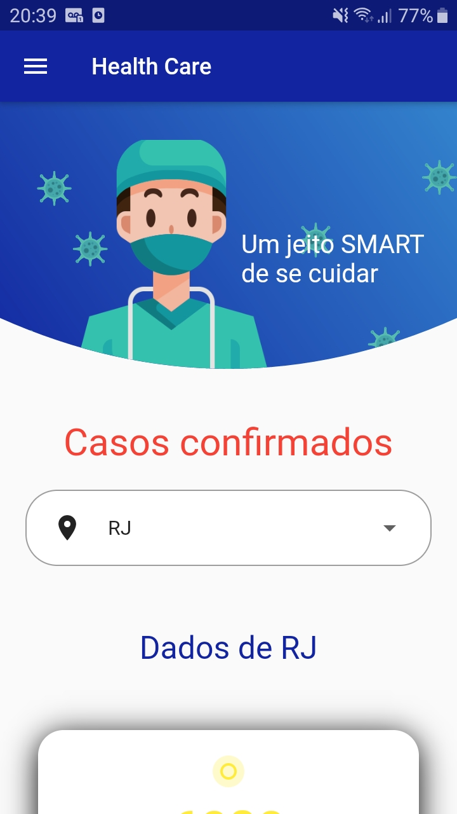
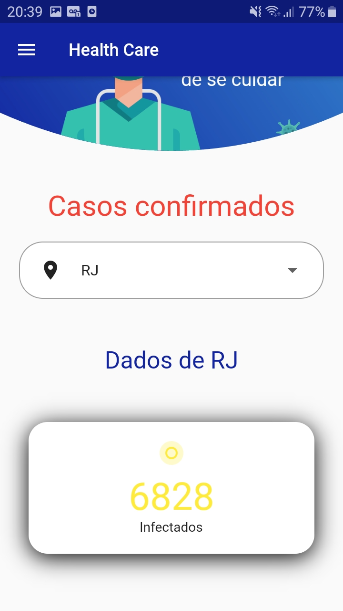
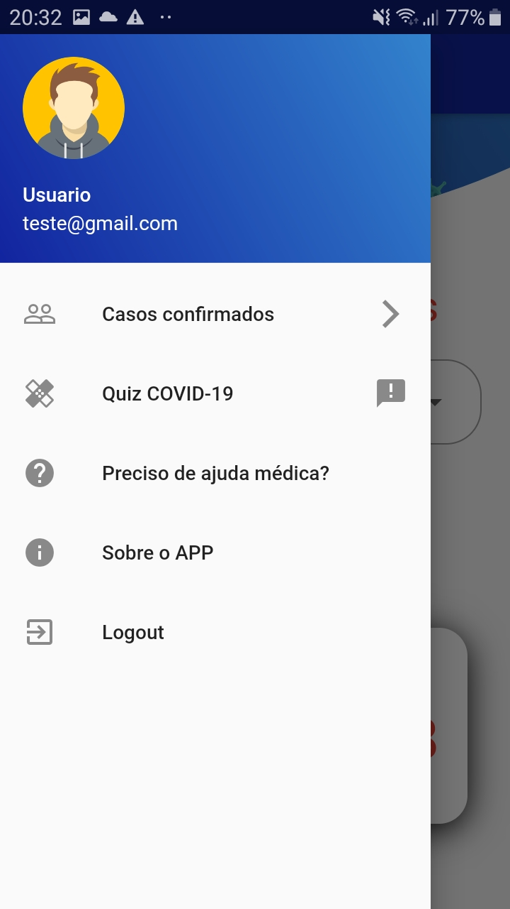

# healthcare

Um aplicativo desenvolvido para fins didáticos, o objetivo inicial é orientar a população sobre a COVID19. Este aplicativo está sendo desenvolvido, os recursos atuais são:

* Visualização do número de casos por estado (Pronto)
* Quiz de perguntas sobre o COVID19 (Em breve)
* Tela e recursos de login (Em breve)

## Telas

     